# 🐳 Stack Docker WordPress — Nginx · PHP-FPM · MariaDB · phpMyAdmin · Fail2Ban · SSL

Déploiement complet d'un site WordPress auto-hébergé avec Nginx en reverse
proxy, PHP-FPM, une base MariaDB, une interface phpMyAdmin, une protection
Fail2Ban et un certificat SSL.

> 📝 Ce README consolide et **corrige** les notes de déploiement d'origine
> (le document de travail contenait trois versions différentes et parfois
> contradictoires du projet). La section [Corrections apportées](#-corrections-apportées-par-rapport-aux-notes-dorigine)
> détaille chaque changement.

## 📐 Architecture

```
Navigateur ──▶ Nginx (80/443) ──▶ WordPress (PHP-FPM :9000) ──▶ MariaDB (:3306)
                   │
                   └──▶ phpMyAdmin (:80 interne, exposé en :8081)

Fail2Ban  ──lit les logs──▶ Nginx (volume partagé nginx_logs)
Certbot   ──challenge HTTP──▶ Nginx (webroot partagé)
```

## 🌳 Arborescence du projet

```
docker-wordpress-stack/
├── docker-compose.yml
├── .env.example
├── nginx/
│   ├── Dockerfile
│   ├── nginx.conf
│   └── conf.d/
│       └── default.conf
├── fail2ban/
│   ├── Dockerfile
│   └── jail.local
├── certbot/
│   ├── webroot/
│   └── letsencrypt/
├── nginx/certificates/        # certificat auto-signé (local uniquement)
├── data/
│   ├── mariadb/
│   └── wordpress/
└── screenshots/                # captures de la mise en place (voir plus bas)
```

## 🚀 Démarrage rapide

```bash
git clone <ton-repo>
cd docker-wordpress-stack

# 1. Copier et compléter les variables d'environnement
cp .env.example .env
# → éditer .env : mots de passe forts, email pour Certbot, etc.

# 2. Créer les dossiers nécessaires
mkdir -p data/mariadb data/wordpress certbot/webroot certbot/letsencrypt nginx/certificates

# 3. Générer un certificat SSL auto-signé (usage local, voir section SSL)
openssl req -x509 -nodes -days 365 \
  -newkey rsa:2048 \
  -keyout nginx/certificates/localhost.key \
  -out nginx/certificates/localhost.crt \
  -subj "/CN=localhost"

# 4. Lancer la stack
docker compose up -d --build
```

- Site WordPress : http://localhost
- phpMyAdmin : http://localhost:8081 (ou via `/phpmyadmin` derrière Nginx)
- Utilisateur/mot de passe MariaDB : ceux définis dans `.env`

## 🔒 À propos du SSL et de Certbot

Le service `certbot` du `docker-compose.yml` **ne peut délivrer un
certificat Let's Encrypt que pour un nom de domaine public qui pointe
réellement vers ce serveur**. Avec `DOMAIN_NAME=localhost` (valeur par
défaut pour un usage local), la commande `certbot certonly` échouera
systématiquement — c'est normal, pas un bug de configuration.

- **En local / développement** : utiliser le certificat auto-signé généré
  à l'étape 3 ci-dessus (déjà branché dans `nginx/conf.d/default.conf`).
- **En production** : renseigner un vrai `DOMAIN_NAME` dans `.env`,
  s'assurer que le DNS pointe vers le serveur et que le port 80 est
  accessible depuis Internet, puis pointer `ssl_certificate` /
  `ssl_certificate_key` vers `/etc/letsencrypt/live/$DOMAIN_NAME/...`.

## 🩹 Corrections apportées par rapport aux notes d'origine

Le document de travail original mélangeait trois versions successives du
projet (avec des services renommés, une variante sans Fail2Ban/Certbot,
etc.). Voici les corrections effectives apportées dans cette version
consolidée :

| # | Problème repéré | Correction |
|---|---|---|
| 1 | `MYSQL_ROOT_PASSWORD` réutilisait le même mot de passe que l'utilisateur applicatif (`WORDPRESS_DB_PASSWORD`) | Variable dédiée `MYSQL_ROOT_PASSWORD` séparée dans `.env` |
| 2 | Port `3306` de MariaDB publié sur l'hôte (`"3306:3306"`) dans une des versions | Port retiré : la base n'est joignable que depuis le réseau Docker interne |
| 3 | `fail2ban` montait `/var/log/nginx` **de l'hôte** au lieu des logs du conteneur `nginx` (`- /var/log/nginx:/var/log/nginx:ro`) | Remplacé par un volume Docker nommé `nginx_logs`, partagé entre `nginx` et `fail2ban` |
| 4 | L'image `nginx` officielle envoie ses logs vers `stdout`/`stderr` par défaut → aucun fichier réel à lire pour Fail2Ban | `nginx.conf` corrigé pour écrire `access.log` / `error.log` dans de vrais fichiers |
| 5 | `nginx.conf` n'incluait pas `mime.types` (juste `include default.conf`) → risque de mauvais `Content-Type` sur les `.css`/`.js` de l'admin WordPress | Bloc `http {}` complété (`mime.types`, `default_type`, `sendfile`, etc.) |
| 6 | `server_name ${DOMAIN_NAME};` dans un fichier `.conf` copié statiquement au build → Nginx **ne substitue jamais** les variables d'environnement dans un `.conf` classique (seuls les templates `/etc/nginx/templates/` le permettent) | Remplacé par `server_name _;` (catch-all), valable en local comme en production |
| 7 | `include snippets/fastcgi-php.conf;` (ligne héritée de Debian/Ubuntu) — **ce fichier n'existe pas** dans l'image officielle `nginx`, ce qui cassait le lien Nginx → WordPress (`Connection reset by peer`, voir captures 6-8) | Remplacé par un bloc `fastcgi_pass`/`fastcgi_param` explicite |
| 8 | Nom du fichier `Dockerfile` mal orthographié (`dokerfile`) dans une des tentatives → `open Dockerfile: no such file or directory` | Rappel : le nom est sensible à la casse et doit être exactement `Dockerfile` |
| 9 | Exemple de `wp-config.php` fourni manuellement, avec des identifiants en dur (`DB_HOST=mysql:3306`, incohérent avec le service `mariadb`) | Supprimé : l'image officielle `wordpress` génère automatiquement `wp-config.php` à partir des variables `WORDPRESS_DB_*` — un fichier manuel n'est ni nécessaire ni recommandé ici |
| 10 | `version: '3.8'` en en-tête du `docker-compose.yml` | Retiré (attribut obsolète depuis Compose v2, génère un warning) |
| 11 | Volumes nommés `mariadb_data` / `wordpress_data` déclarés mais jamais utilisés (les vrais montages étaient des bind mounts `./data/...`) | Nettoyé — un seul mécanisme de stockage (bind mount) utilisé de façon cohérente |
| 12 | Email personnel en clair dans les notes d'origine (`SSL_EMAIL=...@gmail.com`) | Remplacé par un placeholder dans `.env.example` — **ne jamais committer ton vrai `.env`** (ajoute-le à `.gitignore`) |

## 🐛 Historique de mise en œuvre (avec captures d'écran)

Voici le déroulé réel du déploiement, gardé à titre de journal de bord /
retour d'expérience.

### 1. Préparation de l'arborescence et premier build

Création des sous-dossiers puis premier `docker compose up -d --build` :
pull des images en cours.

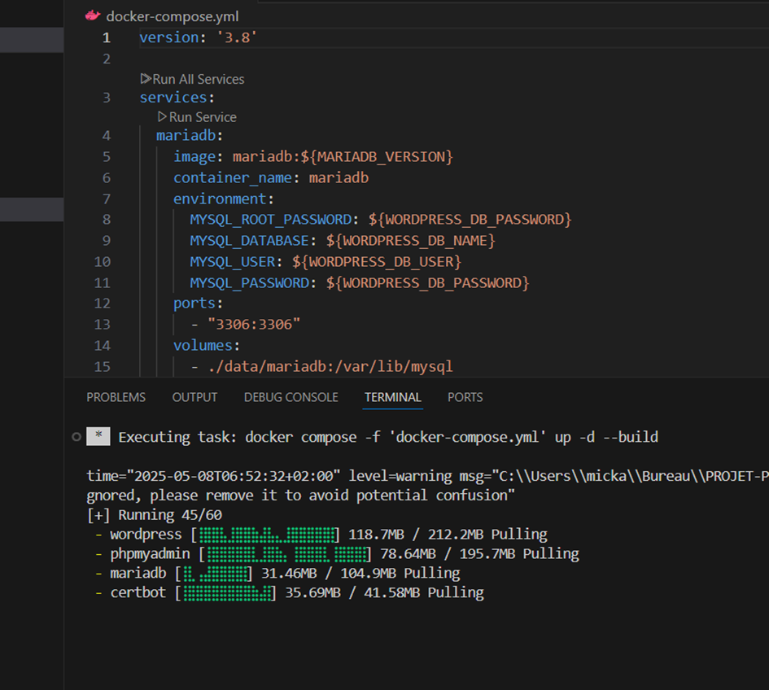

### 2. Erreur : Dockerfile introuvable

```
failed to solve: failed to read dockerfile: open Dockerfile: no such file or directory
```

**Cause** : le fichier avait été nommé `dokerfile` au lieu de `Dockerfile`
(la casse et l'orthographe comptent pour Docker).

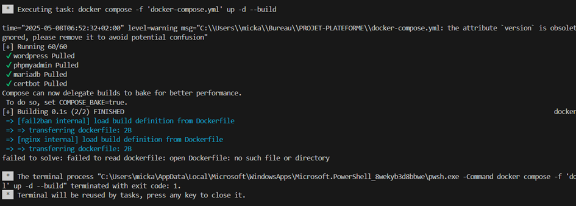

Vérification de l'arborescence obtenue après création des sous-dossiers :

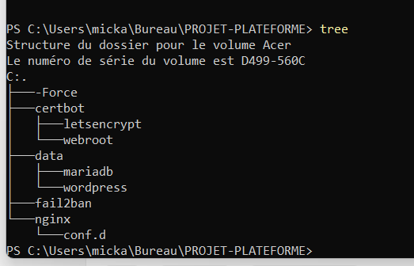

### 3. Build réussi — 9/9 conteneurs démarrés

Une fois le nom de fichier corrigé, le build passe et les 9 services
(mariadb, wordpress, phpmyadmin, nginx, certbot, fail2ban) démarrent :

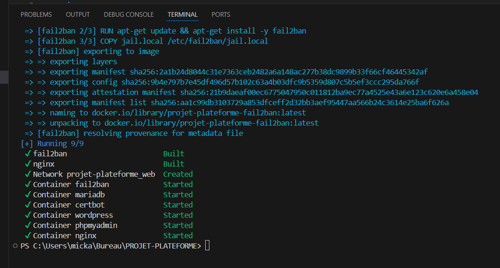

phpMyAdmin est accessible sur `http://localhost:8081` :

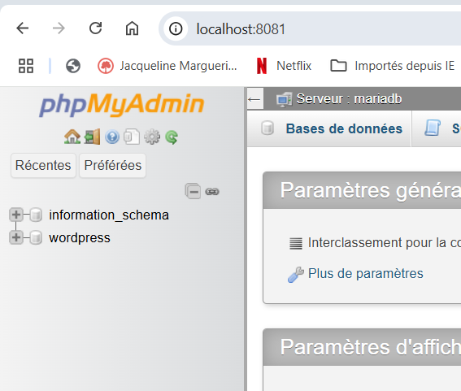

### 4. Problème : Fail2Ban en redémarrage permanent

`docker ps` révèle que le conteneur `fail2ban` boucle en `Restarting` —
conséquence directe des corrections #3 et #4 ci-dessus (pas de vrais
fichiers de logs Nginx à surveiller) :

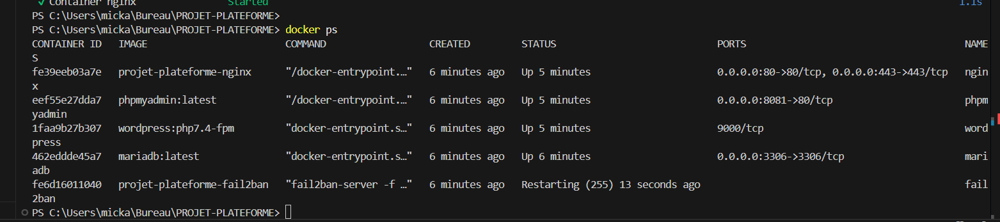

### 5. Problème : impossible de se connecter à WordPress

Les logs de `wordpress` sont pourtant sains (`fpm is running`). Un test
direct depuis le conteneur `nginx` montre la vraie cause :

```
docker exec -it nginx sh
# curl -v http://wordpress:9000
> Recv failure: Connection reset by peer
```

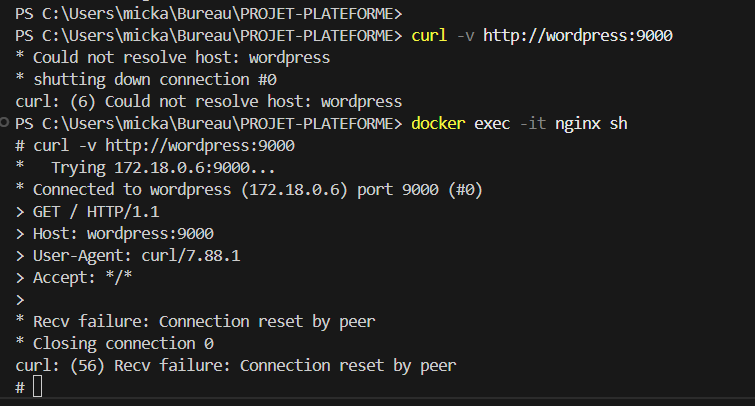

**Cause** : la configuration Nginx utilisait
`include snippets/fastcgi-php.conf;`, une ligne spécifique aux paquets
Debian/Ubuntu qui **n'existe pas** dans l'image Docker officielle de
Nginx (correction #7 ci-dessus).

### 6. Build réussi — 7/7 conteneurs opérationnels

Après correction du bloc FastCGI, tout démarre proprement :

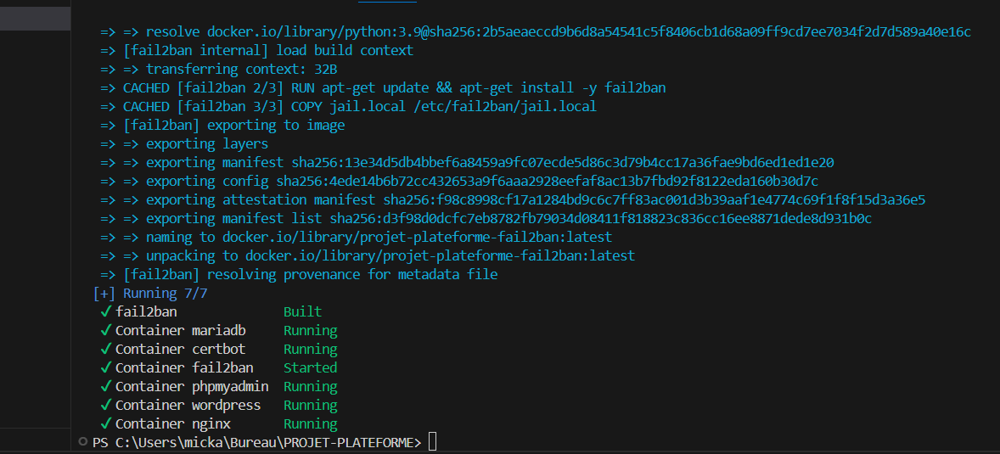

### 7. Vérifications finales

Écran de connexion phpMyAdmin :

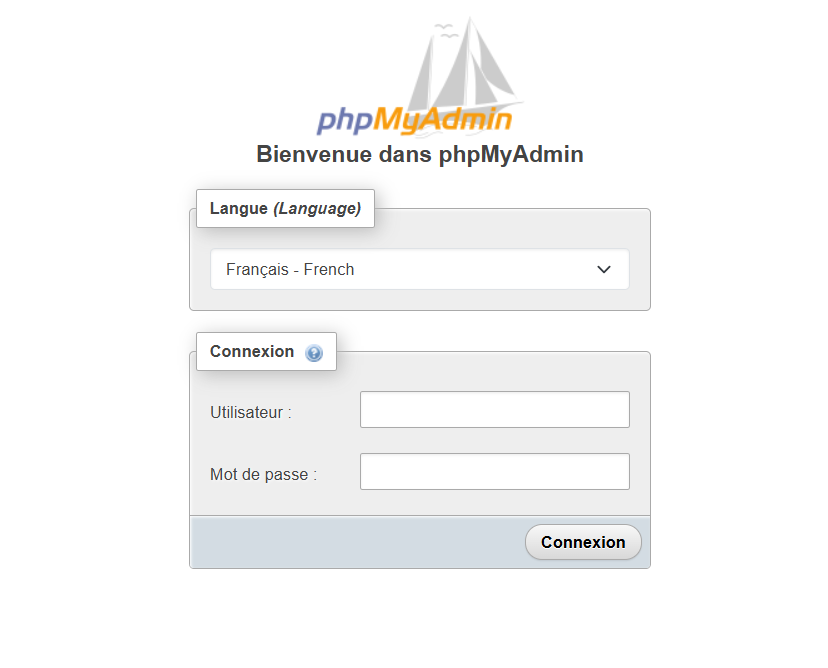

Page d'accueil Nginx par défaut (avant configuration du reverse proxy,
pour vérifier que le conteneur répond bien) :

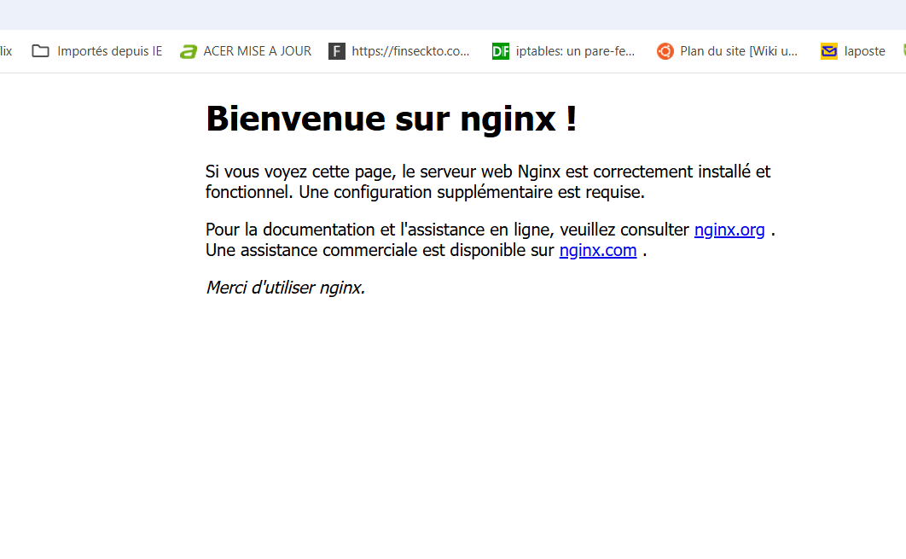

Installation WordPress accessible via le reverse proxy :

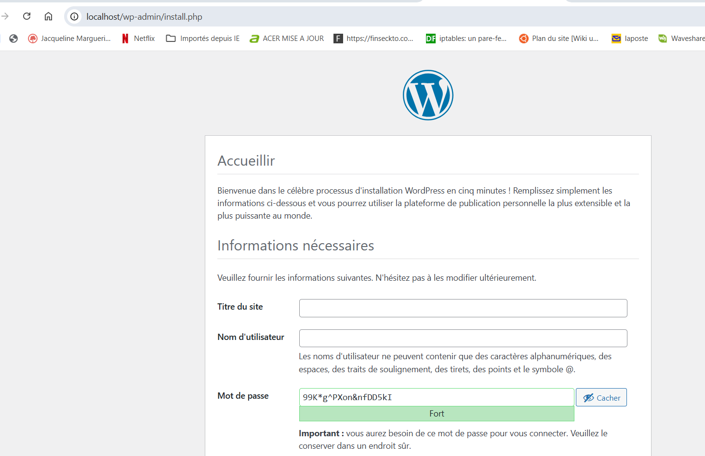

> ⚠️ Cette capture affiche un mot de passe généré en clair. Pense à flouter
> ou recadrer ce type de capture avant de publier un README public.

Site WordPress final opérationnel :

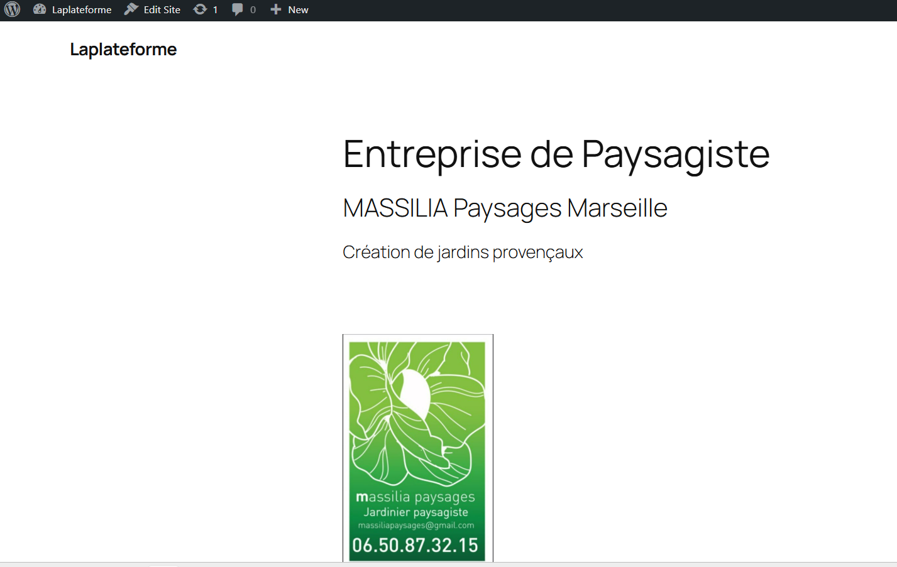

Base `wordpress` bien créée et visible dans phpMyAdmin :

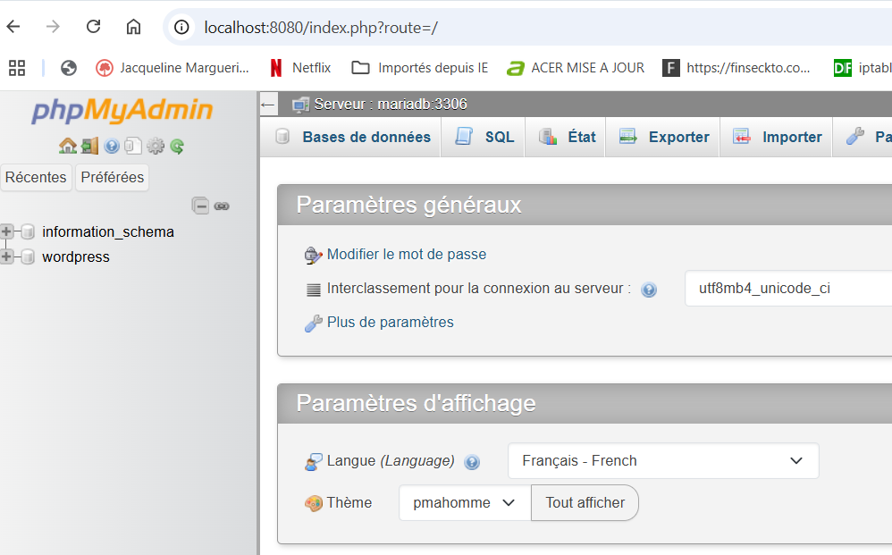

## 🔐 Sécurité — pense-bête avant mise en production

- [ ] Mots de passe forts et **différents** pour `MYSQL_ROOT_PASSWORD` et `WORDPRESS_DB_PASSWORD`
- [ ] `.env` dans `.gitignore` (ne jamais committer de vrais secrets)
- [ ] Port MariaDB **non exposé** sur l'hôte en production
- [ ] Vrai certificat Let's Encrypt via Certbot (nécessite un domaine public)
- [ ] `WP_DEBUG` à `false` en production
- [ ] Sauvegardes régulières de `data/mariadb` et `data/wordpress`

## 📄 Licence

Projet personnel — à adapter librement selon tes besoins.
